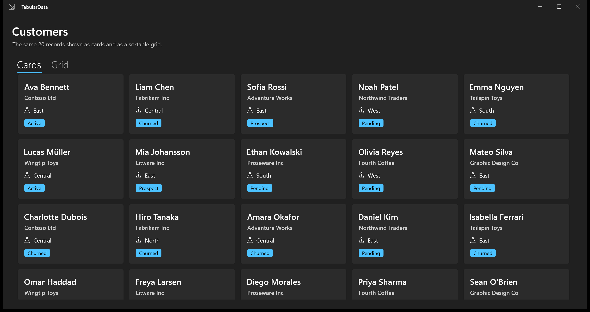
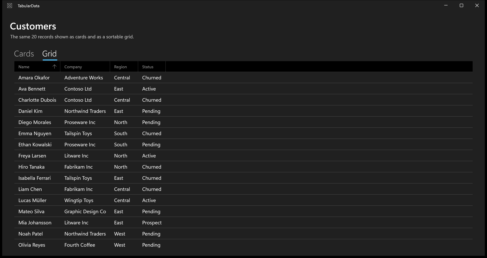
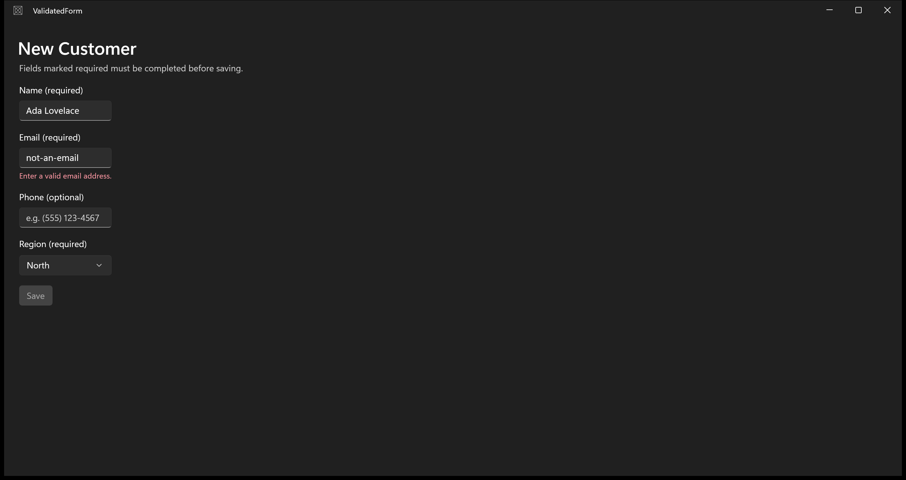
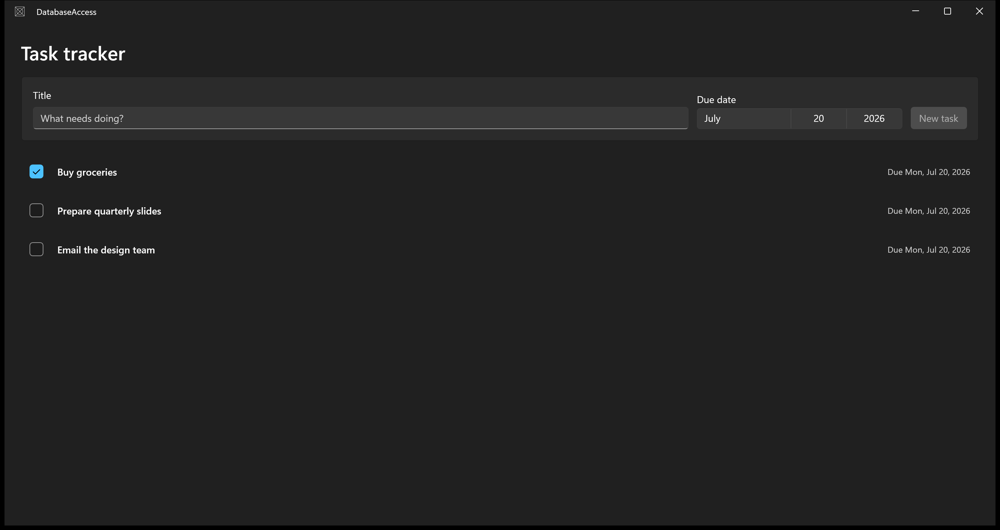
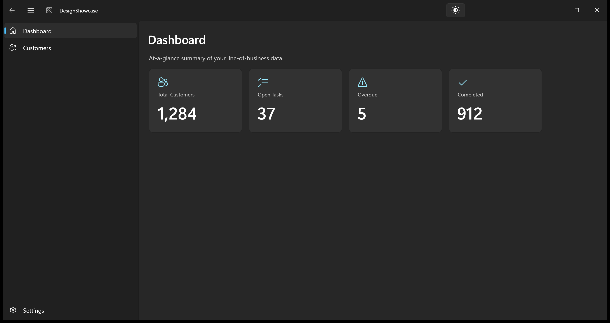
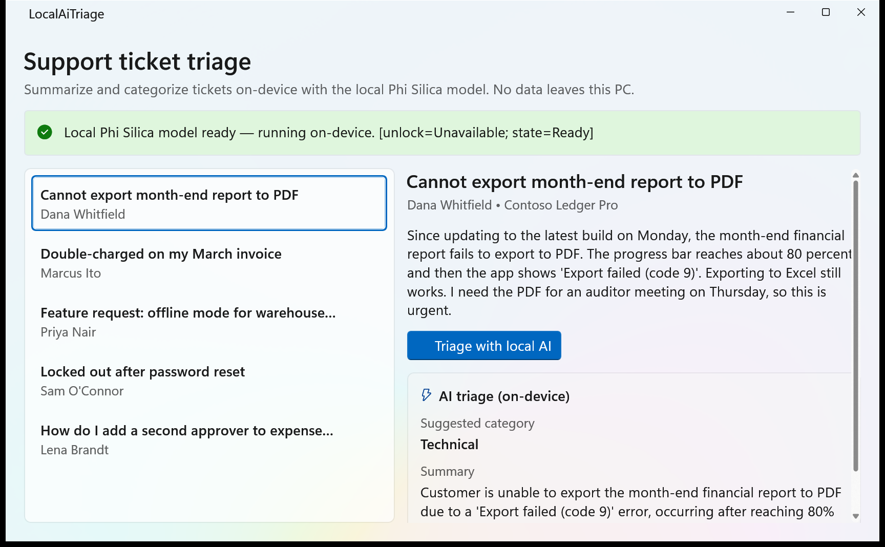
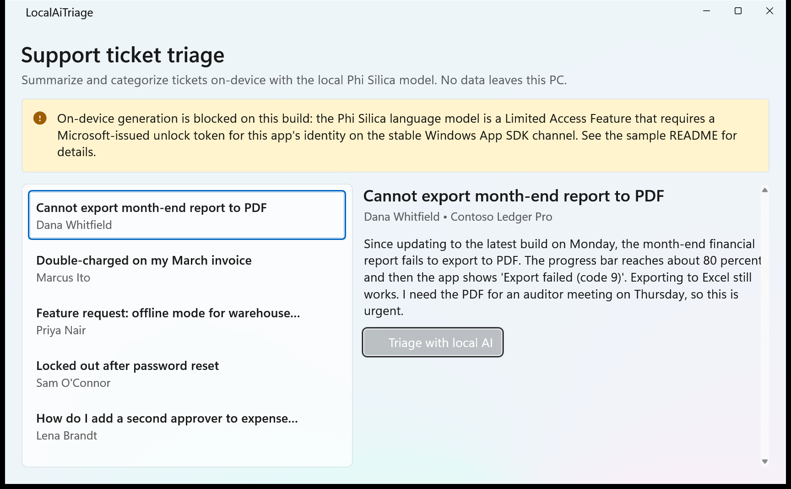

# WinUI 3 Line-of-Business Sample Hub

Five self-contained WinUI 3 (Windows App SDK) desktop samples demonstrating common
line-of-business patterns. Each sample is an independent, buildable Visual Studio
solution. They are linked from the documentation at
[learn.microsoft.com/windows/apps/get-started/line-of-business/](https://learn.microsoft.com/windows/apps/get-started/line-of-business/).

## Samples

| # | Folder | Demonstrates |
|---|--------|--------------|
| 1 | [`WinUI-LOB-Samples/01-TabularData`](WinUI-LOB-Samples/01-TabularData) | `ItemsView` + `DataTemplate` card layout **and** a Community Toolkit `DataGrid` with sortable columns |
| 2 | [`WinUI-LOB-Samples/02-ValidatedForm`](WinUI-LOB-Samples/02-ValidatedForm) | Input validation with `ObservableValidator` (`[Required]`, `[EmailAddress]`), per-keystroke validation, inline errors, Save gated on `HasErrors` |
| 3 | [`WinUI-LOB-Samples/03-DatabaseAccess`](WinUI-LOB-Samples/03-DatabaseAccess) | EF Core + SQLite task tracker, all data access **async and off the UI thread** |
| 4 | [`WinUI-LOB-Samples/04-DesignShowcase`](WinUI-LOB-Samples/04-DesignShowcase) | `NavigationView`, Mica backdrop, compact/normal density toggle, light/dark theme toggle, summary card grid |
| 5 | [`WinUI-LOB-Samples/05-LocalAI`](WinUI-LOB-Samples/05-LocalAI) | **Local AI on a Copilot+ PC** — on-device support-ticket triage (summarize + categorize) with the Phi Silica language model via `Microsoft.Windows.AI.Text.LanguageModel`; no data leaves the device |

## Screenshots

| Sample | Screenshot |
|--------|-----------|
| 1 — TabularData (cards) |  |
| 1 — TabularData (DataGrid, sorted) |  |
| 2 — ValidatedForm (invalid email, Save disabled) |  |
| 3 — DatabaseAccess (task tracker) |  |
| 4 — DesignShowcase (dashboard + Mica) |  |
| 5 — LocalAI (on-device triage, experimental channel) |  |
| 5 — LocalAI (graceful degradation when the LAF gate blocks generation on the stable channel) |  |

## Shared conventions (all samples)

- **WinUI 3 desktop**, Windows App SDK **2.3.1** (stable channel), C# only, `net10.0-windows`.
- **MVVM** throughout — ViewModels derive from `ObservableObject` / `ObservableValidator` (`CommunityToolkit.Mvvm`).
- **`x:Bind`** for all data binding (never `Binding` — see the DataGrid exception below).
- **`ItemsView`** for all collection UI (never `ListView`).
- **`Microsoft.UI.Xaml.*`** only — no UWP `Windows.UI.Xaml.*`, `ApplicationView`, `CoreWindow`, or `CoreApplication`.
- **System theme brushes only** — no hardcoded colors.
- All data loading is **async**; EF Core queries and on-device model calls never run on the UI thread.
- No connection strings or credentials in source; the SQLite path is built at runtime from `LocalApplicationData`.

## Building & running

Each sample requires .NET SDK **10.0.302+**, Windows App SDK, Developer Mode enabled, and the
`winapp` CLI. From a sample's project folder:

```powershell
dotnet build
winapp run          # launch the packaged app (do not run the .exe directly)
```

Every sample builds with **zero errors and zero warnings** and has been launched and validated.

## Key findings (SME-relevant discoveries)

These are the "known unknowns" that were resolved while building the samples — the docs should
reflect these exact values:

1. **Community Toolkit DataGrid NuGet package name (Sample 1).**
   The intuitive/guessed name `CommunityToolkit.WinUI.Controls.DataGrid` **does not exist on
   NuGet**. The DataGrid has *not* migrated to the 8.x `CommunityToolkit.WinUI.Controls.*`
   segmented naming. The correct, current package is:
   ```
   CommunityToolkit.WinUI.UI.Controls.DataGrid   (v7.1.2)
   xmlns: using:CommunityToolkit.WinUI.UI.Controls
   ```
   It requires merging `ms-appx:///CommunityToolkit.WinUI.UI.Controls.DataGrid/Themes/Generic.xaml`
   into `App.xaml`.

2. **DataGrid columns require `{Binding}`, not `{x:Bind}` (Sample 1).**
   `DataGridBoundColumn.Binding` is typed as a classic `Binding`; the framework does not accept
   `x:Bind` there. This is the one sanctioned exception to the "always `x:Bind`" rule — every
   other binding in the samples uses `x:Bind`.

3. **Compact-density resource dictionary URI (Sample 4).**
   The resource dictionary that resolves at runtime on Windows App SDK 2.3.1 is:
   ```
   ms-appx:///Microsoft.UI.Xaml/DensityStyles/Compact.xaml
   ```
   Toggle density by adding/removing a `ResourceDictionary { Source = <that URI> }` on the root
   element's `Resources.MergedDictionaries` — it must be merged **after** `XamlControlsResources`.

4. **Phi Silica API namespace (Sample 5).**
   The current, verified local-AI API is `Microsoft.Windows.AI.Text.LanguageModel` (with the
   readiness enum `Microsoft.Windows.AI.AIFeatureReadyState`). The older
   `Microsoft.Windows.AI.Generative.*` namespace seen in some articles — and in this repo's own
   [`docs/ai-for-lob-apps.md`](docs/ai-for-lob-apps.md) — is **outdated**; that doc needs updating
   (see TODOs). Canonical call sequence:
   ```csharp
   var state = LanguageModel.GetReadyState();          // AIFeatureReadyState
   if (state == AIFeatureReadyState.NotReady) await LanguageModel.EnsureReadyAsync();
   var model = await LanguageModel.CreateAsync();
   var result = await model.GenerateResponseAsync(prompt);   // check result.Status == Complete
   ```
   Requires the restricted capability `systemAIModels` (with the `rescap`/`systemai` manifest
   namespace) — the `dotnet new winui` template already declares it.

5. **Phi Silica is a Limited Access Feature (LAF) on the stable channel (Sample 5).** ⚠️
   On **stable** Windows App SDK 2.3.1, `GenerateResponseAsync` throws *"Access is denied. Limited
   Access Feature is not available: com.microsoft.windows.ai.languagemodel. Status: 3"* for a
   locally dev-registered, unsigned package — even though `GetReadyState()` returns `Ready`, the
   `systemAIModels` capability is granted, and the privacy consent is allowed. `TryUnlockFeature`
   with the machine LAF token returns `Unavailable` because the token is bound to a
   Microsoft-issued **per-package identity**, which a sample can't obtain.
   The official [Windows AI troubleshooting guide](https://learn.microsoft.com/windows/ai/apis/troubleshooting)
   confirms this and recommends the **experimental channel**, which does *not* require a LAF token.
   Verified on this machine: switching to `Microsoft.WindowsAppSDK 2.2.2-experimental9` makes
   on-device generation succeed end-to-end (see the `05-LocalAI-experimental` screenshot). The
   sample ships on **stable** per the shared convention and **degrades gracefully** — it detects
   the gate, shows an explanatory `InfoBar`, and disables the triage button rather than surfacing a
   raw error.

## Open TODOs / SME follow-ups

- **Build toolchain:** `net10.0` requires **MSBuild 18+**. Visual Studio 2022's bundled MSBuild
  (17.14) cannot build these projects, so each sample pins the SDK via `global.json` (10.0.302)
  and builds through the `dotnet` CLI. Ensure the team's standard build host / CI uses a Visual
  Studio version with MSBuild 18, or standardize on `dotnet build`. The `global.json` files can be
  relaxed once that is confirmed.
- **Sample 3 – schema evolution:** uses `EnsureCreatedAsync()` (does not support schema changes).
  Switch to EF Core **migrations** for a production app.
- **Sample 3 – persistence layer:** no edit/delete-task UI yet (spec covered add + complete only).
- **Sample 2 – `Save()` is a stub** (shows an InfoBar and resets the form); wire it to a real
  service layer for an actual LOB app.
- **Sample 3 – supply chain:** the transitive `SQLitePCLRaw.lib.e_sqlite3 2.1.11` carried
  CVE-2025-6965; pinned `SQLitePCLRaw.bundle_e_sqlite3 2.1.12` to stay clean. Bump when EF Core
  ships a newer transitive default.
- **Sample 5 – local AI runtime gate (needs SME/environment decision).** On-device Phi Silica
  generation is blocked on the **stable** channel by the Limited Access Feature gate (see Key
  Finding 5). Options for the docs: (a) ship on stable with graceful degradation as done here and
  document that end-to-end generation requires either a Microsoft-issued LAF token or the
  experimental channel; or (b) target the experimental channel for the live-AI walkthrough
  (note: `ItemsView`/`ItemContainer` are marked evaluation-only there and emit `CS8305`, so it
  can't hit zero warnings without `<NoWarn>`). SME to confirm the intended guidance for readers.
- **Sample 5 – SDK pin divergence.** This machine only has .NET SDK **10.0.300-preview.0.26177.108**
  installed (not 10.0.302), so `05-LocalAI/.../global.json` pins that preview to build and run
  locally. Normalize to **10.0.302** (matching Samples 1–4) on a host that has it installed.
- **Sample 5 – `docs/ai-for-lob-apps.md` updated.** The Phi Silica section now uses the correct
  `Microsoft.Windows.AI.Text.LanguageModel` API (was the outdated `Microsoft.Windows.AI.Generative`)
  and documents the LAF gate / channel guidance. SME to review the wording.
