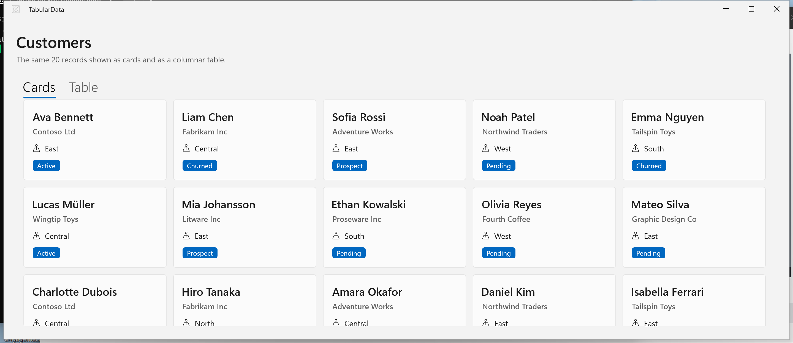
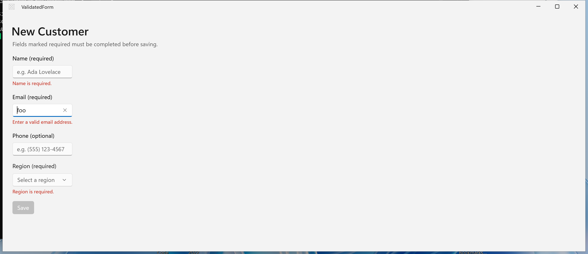
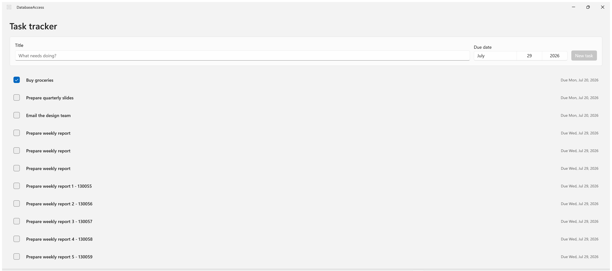
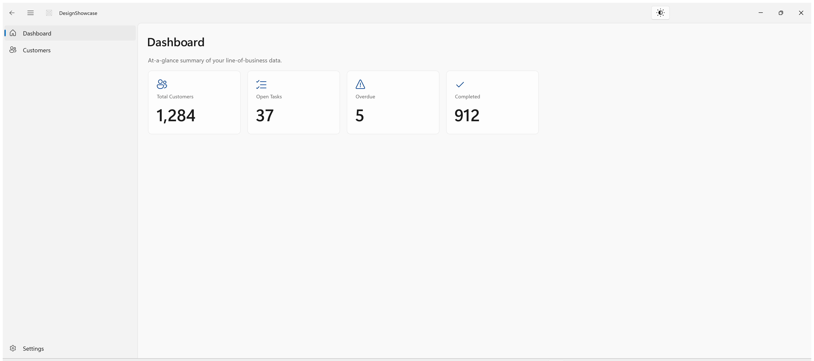

# WinUI 3 line-of-business samples

This repository contains five independent WinUI 3 desktop samples for common line-of-business (LOB) scenarios. The corresponding documentation is being prepared in [MicrosoftDocs/windows-dev-docs-pr#7160](https://github.com/MicrosoftDocs/windows-dev-docs-pr/pull/7160).

## Samples

| # | Folder | Demonstrates |
|---|---|---|
| 1 | [`01-TabularData`](WinUI-LOB-Samples/01-TabularData) | An `ItemsView` card layout and a simple columnar `ListView` layout |
| 2 | [`02-ValidatedForm`](WinUI-LOB-Samples/02-ValidatedForm) | One possible validation implementation using `ObservableValidator`, inline errors, and command enablement |
| 3 | [`03-DatabaseAccess`](WinUI-LOB-Samples/03-DatabaseAccess) | EF Core with a local SQLite database |
| 4 | [`04-DesignShowcase`](WinUI-LOB-Samples/04-DesignShowcase) | `NavigationView`, Mica, theme-aware cards, and app settings |
| 5 | [`05-LocalAI`](WinUI-LOB-Samples/05-LocalAI) | On-device support-ticket triage with the Phi Silica `LanguageModel` API and graceful availability handling |

These samples illustrate approaches, not universal framework recommendations. In particular:

- WinUI 3 doesn't include a first-party DataGrid.
- WinUI 3 doesn't provide a complete form-validation framework. Sample 2 uses `ObservableValidator` as one option.
- Apply default control sizing unless a tested workflow requires targeted adjustments; don't apply deprecated compact-density resources app-wide.
- Sample 5 targets Phi Silica during the transition to Aion Instruct. Check current Windows AI requirements before using it in production.

## Screenshots

| Sample | Screenshot |
|---|---|
| Tabular data |  |
| Validated form |  |
| Database access |  |
| Design showcase |  |
| Local AI |  |

## Requirements

- Windows 11
- .NET SDK 10.0.302 or a compatible newer feature-band patch
- Developer Mode
- The `winapp` CLI for launching the packaged app

The projects currently target `net10.0-windows10.0.26100.0` and Windows App SDK 2.3.1.

## Build

Open a sample's project directory and run:

```powershell
dotnet build -p:Platform=x64
winapp run
```

All five samples have been built for x64 with the Windows App SDK analyzer enabled and produce zero warnings and zero errors.

## Implementation notes

- The samples use `Microsoft.UI.Xaml` types. Other `Windows.*` Windows Runtime APIs can still be valid in a WinUI 3 desktop app.
- Bindings specify their mode when values can change.
- Theme-aware surfaces use WinUI theme resources instead of hardcoded colors.
- Database paths are created at runtime beneath the current user's local application-data folder.
- The SQLite sample uses `EnsureCreatedAsync` for simplicity. Use EF Core migrations when a production app must evolve an existing schema.
- The local AI sample detects unsupported or access-gated configurations and disables generation with an explanatory status message.

## Documentation mirror

The [`docs`](docs) folder mirrors the proposed Learn articles for public review. Microsoft Learn becomes the source of truth after the documentation PR is published.
