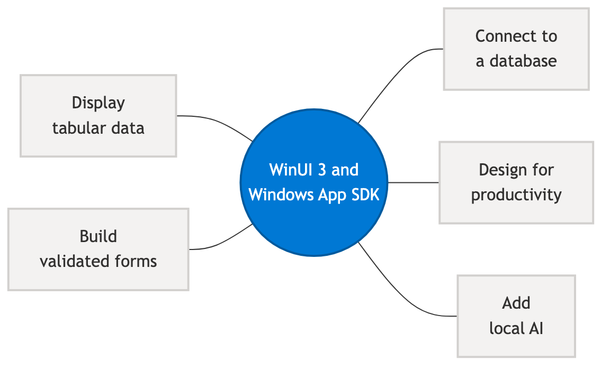

# Build line-of-business apps with WinUI — overview

This hub is for developers building line-of-business (LOB) apps — internal tools, data-entry apps, reporting dashboards, and enterprise clients — using WinUI 3 and the Windows App SDK.

WinUI 3 offers modern Fluent Design controls, strong data-binding support, and full access to Windows platform APIs. LOB developers coming from WPF, WinForms, or UWP will find familiar XAML patterns alongside new capabilities for authentication, offline data, and enterprise deployment.

Use the sections below to find guidance based on where you are in your journey.

> [!NOTE]
> This is a wayfinding hub. Each section links to existing canonical topics or first-wave stub articles. Stub articles are marked **[Draft]** and contain `> [!TODO]` callouts where content requires SME validation.

> [!TIP]
> **Common starting points for WinUI 3 LOB apps.** These are general guidelines, not absolute rules — validate specifics against the Windows App SDK version you target.
>
> - Use the `Microsoft.UI.Xaml.*` namespaces for XAML types. The `Windows.UI.Xaml.*` XAML namespaces belong to UWP and don't apply to a WinUI 3 desktop app. (Many other `Windows.*` Windows Runtime APIs remain usable from WinUI 3.)
> - Prefer `ItemsView` for new list and collection UI; `ListView` remains fully supported.
> - Bind data with `x:Bind` against an `ObservableCollection<T>`. UI-only code-behind (for example, toggling a control's visibility) is fine in MVVM.
> - Use the async APIs for anything that does file or network I/O — HTTP requests, database queries, and AI inference — so the UI thread stays responsive. `HttpClient` exposes only asynchronous methods, so use `async`/`await` consistently.
> - Use `WebAccountManager` (WAM) for Entra ID and Microsoft account sign-in.
> - Store connection strings and tokens in Windows Credential Manager, not in source code.
> - Use EF Core with SQLite for local structured data.
> - The UWP view APIs `ApplicationView.GetForCurrentView()`, `CoreWindow.GetForCurrentThread()`, and `CoreApplication.MainView` don't apply to WinUI 3 desktop apps; use `AppWindow` and the `Window` reference instead.
> - Some Windows Runtime APIs (for example, `FileOpenPicker`) require HWND initialization with `WinRT.Interop.InitializeWithWindow.Initialize` before use in a desktop app.

> [!TODO] SME review: confirm this quick-reference list and the recommended stack versions, and remove any items that aren't broadly applicable to LOB scenarios.

## Quick decision guide

Use this table to choose the right approach for common LOB requirements.

| I need to... | Recommended approach | Do not use |
|---|---|---|
| Display a list of records | `ItemsView` or `ListView` with a `DataTemplate` | — |
| Display dense tabular/grid data | `ListView` or `ItemsView` with a columnar `DataTemplate` (see [Display tabular data](display-tabular-data.md)) | — |
| Validate form input | `ObservableValidator` from the `CommunityToolkit.Mvvm` package — see [Build a validated form](build-validated-form.md) for examples | WPF `Validation` class (WPF-only) |
| Show a modal dialog | `ContentDialog` (requires `XamlRoot`) | — |
| Pick a file | `FileOpenPicker` + `InitializeWithWindow` | `OpenFileDialog` (WinForms/WPF only) |
| Sign in with Entra ID or Microsoft account | `WebAccountManager` (WAM) | Raw OAuth `HttpClient` flow |
| Store structured data locally | EF Core + SQLite | Direct file I/O for relational data |
| Call a remote database | EF Core via a service layer (REST/gRPC) | Direct SQL connection with embedded credentials |
| Load data without blocking the UI | `async`/`await` + `DispatcherQueue.TryEnqueue` | Synchronous calls on the UI thread |
| Run on-device AI inference | Phi Silica (Copilot+ PC) or ONNX Runtime | Synchronous inference on the UI thread |
| Send notifications | `AppNotificationManager` (works packaged and unpackaged) | `ToastNotificationManager` (requires package identity) |
| Deploy to managed enterprise devices | MSIX packaged app | Unpackaged for scenarios requiring enterprise IT management |

## Build a new app

> [!NOTE]
> **XAML namespaces:** WinUI 3 uses the `Microsoft.UI.Xaml.*` XAML namespaces. Samples that reference the `Windows.UI.Xaml.*` XAML namespaces (for example, `Windows.UI.Xaml.Controls`) target UWP and won't work unchanged in a WinUI 3 desktop app. This doesn't mean every `Windows.*` API is off-limits — many Windows Runtime APIs are called directly from WinUI 3 apps.

If you are starting a new LOB app from scratch, WinUI 3 gives you modern controls, a rich data-binding model, and built-in support for enterprise deployment scenarios.

### Display and edit data

Most LOB apps center on displaying, filtering, and editing structured data. WinUI 3 provides several options depending on your data shape and density.

- [Display tabular data in a WinUI app](display-tabular-data.md) **[Draft]** — options for grid-style data presentation using `ListView` and `ItemsView`
- [Data binding overview](../../develop/data-binding/data-binding-overview.md) — bind UI controls to data sources using XAML and `x:Bind`
- [Data binding in depth](../../develop/data-binding/data-binding-in-depth.md) — converters, change notification, and collection views
- [Data binding and MVVM](../../develop/data-binding/data-binding-and-mvvm.md) — structuring your app with Model-View-ViewModel
- [List views and grid views](../../develop/ui/controls/listview-and-gridview.md) — selecting and using `ListView` and `GridView`

### Build forms with validation

LOB apps frequently require data-entry forms with input validation.

- [Build a data-entry form with validation](build-validated-form.md) **[Draft]** — validate input with `ObservableValidator` from the MVVM Toolkit (`CommunityToolkit.Mvvm`)

- [Controls overview](../../develop/ui/controls/index.md)

### Connect to data

- [Connect a WinUI app to a database](connect-to-a-database.md) **[Draft]** — use Entity Framework Core (EF Core) with SQLite or SQL Server, load data asynchronously, and cache for offline scenarios

- [HTTP client](../../develop/networking/httpclient.md) — make HTTP calls to REST APIs and AI service endpoints

### Authentication (Entra ID / MSAL)

Enterprise apps typically need user sign-in via Microsoft Entra ID (formerly Azure Active Directory) using the Microsoft Authentication Library (MSAL).

- [Web Account Manager (WAM)](../../develop/security/web-account-manager.md) — integrate OS-brokered sign-in for Microsoft accounts and Entra ID
- [OAuth 2.0 and OpenID Connect](../../develop/security/oauth2.md) — protocol-level authentication patterns

> [!TODO] Add a link to a new "Authenticate with Entra ID using MSAL in WinUI 3" how-to once it is drafted. MSAL for .NET supports WinUI 3 via the WAM broker; the specific setup steps require SME validation.

### Enterprise deployment

WinUI 3 apps can be distributed as MSIX packages (recommended for enterprise), as packaged apps with external location, or as unpackaged executables.

- [Deployment overview](../../package-and-deploy/deploy-overview.md) — understand the three deployment modes
- [Choose a distribution method](../../package-and-deploy/choose-distribution-path.md) — decision guide for enterprise, Store, and sideload scenarios

## Modernize an existing app

If you have an existing WPF or WinForms app, you can add Windows App SDK APIs incrementally — without rewriting your entire app.

You can add Windows App SDK APIs incrementally to an existing WPF or WinForms app without rewriting it. See [Use the Windows App SDK in an existing project](../../windows-app-sdk/use-windows-app-sdk-in-existing-project.md).

Key capabilities you can add to existing .NET apps with the Windows App SDK include modern notifications, app lifecycle, windowing, and push notifications. Full WinUI 3 UI requires migrating to a WinUI 3 project, but other APIs can be called from WPF, WinForms, and Win32.

## Port from WPF, WinForms, or UWP

If you are migrating an existing app to WinUI 3, use the following resources.

### Migrate from WPF

- [WPF patterns and their WinUI 3 equivalents](../../windows-app-sdk/migrate-to-windows-app-sdk/wpf-patterns-winui3.md) — side-by-side pattern mapping for controls, binding, navigation, and more
- [Migration decision guide](../../windows-app-sdk/migrate-to-windows-app-sdk/migration-decision-guide.md) — evaluate whether to rewrite or incrementally modernize
- [Migration strategy overview](../../windows-app-sdk/migrate-to-windows-app-sdk/overall-migration-strategy.md)

### Migrate from WinForms

- [WinForms patterns and their WinUI 3 equivalents](migrate-winforms-patterns.md) **[Draft]** — stub pattern mapping table; WPF equivalent published at the link above

> [!TODO] Link to a "WinForms to WinUI 3" migration guide in the Windows App SDK migration section once it is authored. The WPF patterns page (`wpf-patterns-winui3.md`) is the canonical model.

### Migrate from UWP

- [UWP to Windows App SDK migration overview](../../windows-app-sdk/migrate-to-windows-app-sdk/migrate-to-windows-app-sdk-ovw.md)
- [WinUI 3 migration guide](../../windows-app-sdk/migrate-to-windows-app-sdk/guides/winui3.md)
- [API mapping table](../../windows-app-sdk/migrate-to-windows-app-sdk/api-mapping-table.md)

## Add AI to your app

AI capabilities are increasingly expected in enterprise apps. WinUI 3 apps can use on-device models (keeping sensitive data off the network) or call connected Azure AI services. Windows platform AI APIs such as App Content Search and Phi Silica (Copilot+ PC) are also available to desktop apps.

- [Add AI capabilities to a line-of-business WinUI app](ai-for-lob-apps.md) **[Draft]** — on-device inference, Azure OpenAI, Windows platform AI APIs, and practical LOB scenarios

> [!TODO] Add links to Phi Silica and App Content Search reference docs once canonical paths are confirmed.

## Design for productivity

WinUI 3 apps look modern on Windows 11 by default — theming, dark mode, system accent color, and accessibility are handled automatically by the inbox controls. For LOB apps, the priority is clarity and speed over decoration.

- [Design for productivity in WinUI LOB apps](design-for-lob.md) **[Draft]** — theming, materials (Mica/Acrylic), accessibility, responsive layout, and navigation patterns

## Related content

- [Windows App SDK overview](../../windows-app-sdk/index.md)
- [WinUI 3 overview](../../winui/winui3/index.md)
- [Packaging and deployment overview](../../package-and-deploy/deploy-overview.md)
- [Security overview](../../develop/security/index.md)
- [LOB samples repo](https://github.com/GrantMeStrength/LOB)
